# 🌍 AI Trip Planner

A full-stack AI-powered trip planning application that creates personalized travel itineraries using Google Gemini AI, with Auth0 authentication, Firebase integration, and Google Places API.

## ✨ Features

- **🤖 AI-Powered Itineraries**: Generate detailed day-by-day travel plans using Google Gemini AI
- **🔐 Secure Authentication**: Auth0 integration with Google OAuth support
- **🗺️ Real Place Data**: Google Places API integration with photos and ratings
- **💾 Cloud Storage**: Firebase Firestore for real-time data synchronization
- **📱 Responsive Design**: Beautiful, mobile-first UI with Tailwind CSS
- **🎨 Modern UI Components**: ShadCN UI components with smooth animations
- **📊 Trip Analytics**: Personal travel statistics and insights
- **🌐 Google Maps Integration**: Direct navigation links to all locations

## 📊 System Analysis & Design

### 🎯 Use Case Diagram

```mermaid
graph TB
    %% Actors
    Guest[👤 Guest User]
    User[👤 Registered User]
    Admin[👤 Admin]
    GeminiAI[🤖 Gemini AI]
    Auth0[🔐 Auth0]
    GoogleAPI[🗺️ Google Places API]
    
    %% Use Cases
    subgraph "Authentication System"
        UC1[Sign Up/Login]
        UC2[Logout]
        UC3[View Profile]
        UC4[Update Profile]
    end
    
    subgraph "Trip Planning System"
        UC5[Browse Destinations]
        UC6[Create Trip]
        UC7[Generate AI Itinerary]
        UC8[View Trip Details]
        UC9[Edit Trip]
        UC10[Delete Trip]
        UC11[Export Trip PDF]
    end
    
    subgraph "Community Features"
        UC12[View Community Trips]
        UC13[Share Trip]
        UC14[Like/Comment on Trips]
        UC15[Follow Users]
    end
    
    subgraph "Content Management"
        UC16[Read Blog Posts]
        UC17[Search Destinations]
        UC18[Get Help/Support]
        UC19[Contact Support]
    end
    
    subgraph "Admin Functions"
        UC20[Manage Users]
        UC21[Manage Content]
        UC22[View Analytics]
        UC23[Moderate Community]
    end
    
    %% Relationships
    Guest --> UC1
    Guest --> UC5
    Guest --> UC12
    Guest --> UC16
    Guest --> UC17
    Guest --> UC18
    Guest --> UC19
    
    User --> UC1
    User --> UC2
    User --> UC3
    User --> UC4
    User --> UC5
    User --> UC6
    User --> UC7
    User --> UC8
    User --> UC9
    User --> UC10
    User --> UC11
    User --> UC12
    User --> UC13
    User --> UC14
    User --> UC15
    User --> UC16
    User --> UC17
    User --> UC18
    User --> UC19
    
    Admin --> UC20
    Admin --> UC21
    Admin --> UC22
    Admin --> UC23
    
    %% External System Interactions
    UC1 --> Auth0
    UC7 --> GeminiAI
    UC6 --> GoogleAPI
    UC8 --> GoogleAPI
```



### 📈 Data Flow Diagram (DFD)

#### Level 0 - Context Diagram

```mermaid
graph TB
    %% External Entities
    User[👤 User]
    GuestUser[👤 Guest User]
    GeminiAI[🤖 Gemini AI Service]
    Auth0Service[🔐 Auth0 Service]
    GooglePlaces[🗺️ Google Places API]
    
    %% Main System
    TripPlannerSystem[🌍 AI Trip Planner System]
    
    %% Data Flows
    User -->|Trip Preferences, User Data| TripPlannerSystem
    TripPlannerSystem -->|Personalized Itineraries, Trip Data| User
    
    GuestUser -->|Browse Requests| TripPlannerSystem
    TripPlannerSystem -->|Public Content, Destinations| GuestUser
    
    TripPlannerSystem -->|Trip Requirements| GeminiAI
    GeminiAI -->|Generated Itineraries| TripPlannerSystem
    
    TripPlannerSystem -->|Authentication Requests| Auth0Service
    Auth0Service -->|User Credentials, Tokens| TripPlannerSystem
    
    TripPlannerSystem -->|Place Queries| GooglePlaces
    GooglePlaces -->|Place Details, Photos| TripPlannerSystem
```



#### Level 1 - System Overview

```mermaid
graph TB
    %% External Entities
    User[👤 User]
    GuestUser[👤 Guest User]
    GeminiAI[🤖 Gemini AI]
    Auth0[🔐 Auth0]
    GoogleAPI[🗺️ Google Places API]
    
    %% Main Processes
    P1[1.0 User Authentication]
    P2[2.0 Trip Planning]
    P3[3.0 Content Management]
    P4[4.0 Community Features]
    P5[5.0 Data Management]
    
    %% Data Stores
    DS1[(D1: User Database)]
    DS2[(D2: Trip Database)]
    DS3[(D3: Content Database)]
    DS4[(D4: Community Database)]
    
    %% Data Flows
    User -->|Login Credentials| P1
    P1 -->|Authentication Request| Auth0
    Auth0 -->|User Token| P1
    P1 -->|User Data| DS1
    P1 -->|Authenticated User| User
    
    User -->|Trip Preferences| P2
    P2 -->|AI Request| GeminiAI
    GeminiAI -->|Generated Itinerary| P2
    P2 -->|Place Query| GoogleAPI
    GoogleAPI -->|Place Data| P2
    P2 -->|Trip Data| DS2
    P2 -->|Completed Trip| User
    
    User -->|Content Request| P3
    GuestUser -->|Browse Request| P3
    P3 -->|Content Data| DS3
    P3 -->|Content| User
    P3 -->|Public Content| GuestUser
    
    User -->|Community Action| P4
    P4 -->|Community Data| DS4
    P4 -->|Community Content| User
    
    P2 -->|Trip Data| P5
    P4 -->|Community Data| P5
    P5 -->|Stored Data| DS2
    P5 -->|Stored Data| DS4
```



#### Level 2 - Trip Planning Process Detail

```mermaid
graph TB
    %% External Entities
    User[👤 User]
    GeminiAI[🤖 Gemini AI]
    GoogleAPI[🗺️ Google Places API]
    
    %% Sub-processes
    P21[2.1 Collect Trip Requirements]
    P22[2.2 Validate Input Data]
    P23[2.3 Generate AI Itinerary]
    P24[2.4 Enhance with Real Data]
    P25[2.5 Store Trip Data]
    P26[2.6 Present Trip to User]
    
    %% Data Stores
    DS1[(D1: User Preferences)]
    DS2[(D2: Trip Database)]
    DS3[(D3: Place Cache)]
    
    %% Data Flows
    User -->|Destination, Dates, Budget, Preferences| P21
    P21 -->|Raw Trip Data| P22
    P21 -->|User Preferences| DS1
    
    P22 -->|Validated Data| P23
    P22 -->|Validation Errors| User
    
    P23 -->|Trip Parameters| GeminiAI
    GeminiAI -->|AI Generated Itinerary| P23
    P23 -->|Base Itinerary| P24
    
    P24 -->|Place Queries| GoogleAPI
    GoogleAPI -->|Place Details, Photos| P24
    P24 -->|Place Data| DS3
    P24 -->|Enhanced Itinerary| P25
    
    P25 -->|Complete Trip| DS2
    P25 -->|Trip ID| P26
    
    P26 -->|Trip Data| DS2
    P26 -->|Final Itinerary| User
```



### 🗄️ Entity Relationship Diagram (ERD)


## 🏗️ Architecture

### Frontend (React + Vite)
- **Framework**: React 18 with Vite for fast development
- **Styling**: Tailwind CSS + ShadCN UI components
- **Authentication**: Auth0 React SDK
- **Database**: Firebase Firestore
- **AI Integration**: Google Gemini API
- **Maps**: Google Places API + Google Maps links
- **Animations**: Framer Motion

### Backend (Node.js + Express)
- **Framework**: Express.js with MongoDB
- **Authentication**: JWT + Auth0 integration
- **AI Service**: Google Gemini API integration
- **Places Service**: Google Places API wrapper
- **Security**: Helmet, CORS, Rate limiting
- **Validation**: Express Validator

## 🚀 Quick Start

### Prerequisites
- Node.js 18+ and npm
- MongoDB (local or Atlas)
- Auth0 account
- Google Cloud account (for Gemini AI and Places API)
- Firebase project

### 1. Clone and Install
```bash
git clone <repository-url>
cd ai-trip-planner

# Install root dependencies
npm install

# Install frontend dependencies
cd frontend && npm install

# Install backend dependencies
cd ../backend && npm install
```

### 2. Environment Setup

**Frontend (.env)**:
```env
VITE_AUTH0_DOMAIN=your-auth0-domain.auth0.com
VITE_AUTH0_CLIENT_ID=your-auth0-client-id
VITE_FIREBASE_API_KEY=your-firebase-api-key
VITE_FIREBASE_AUTH_DOMAIN=your-project.firebaseapp.com
VITE_FIREBASE_PROJECT_ID=your-project-id
VITE_FIREBASE_STORAGE_BUCKET=your-project.appspot.com
VITE_FIREBASE_MESSAGING_SENDER_ID=123456789
VITE_FIREBASE_APP_ID=1:123456789:web:abcdef
VITE_GEMINI_API_KEY=your-gemini-api-key
VITE_GOOGLE_PLACES_API_KEY=your-google-places-api-key
```

**Backend (.env)**:
```env
PORT=5000
NODE_ENV=development
FRONTEND_URL=http://localhost:3000
MONGODB_URI=mongodb://localhost:27017/tripplanner
JWT_SECRET=your-super-secret-jwt-key
GEMINI_API_KEY=your-gemini-api-key
GOOGLE_PLACES_API_KEY=your-google-places-api-key
```

### 3. API Keys Setup

#### Auth0 Setup
1. Create Auth0 application
2. Enable Google social connection
3. Configure callback URLs: `http://localhost:3000`
4. Get Domain and Client ID

#### Firebase Setup
1. Create Firebase project
2. Enable Firestore database
3. Get configuration object
4. Set up security rules

#### Google Cloud Setup
1. Enable Gemini AI API
2. Enable Places API
3. Create API keys
4. Set up billing (required for Places API)

### 4. Run the Application

```bash
# Start both frontend and backend
npm run dev

# Or run separately:
# Frontend (http://localhost:3000)
cd frontend && npm run dev

# Backend (http://localhost:5000)
cd backend && npm run dev
```

## 📁 Project Structure

```
ai-trip-planner/
├── frontend/                 # React frontend
│   ├── src/
│   │   ├── components/      # Reusable UI components
│   │   ├── pages/          # Page components
│   │   ├── context/        # React context providers
│   │   ├── services/       # API services
│   │   ├── hooks/          # Custom React hooks
│   │   └── lib/            # Utility functions
│   ├── public/             # Static assets
│   └── package.json
├── backend/                 # Node.js backend
│   ├── routes/             # API routes
│   ├── models/             # MongoDB models
│   ├── services/           # Business logic
│   ├── middleware/         # Express middleware
│   └── server.js           # Entry point
└── package.json            # Root package.json
```

## 🔧 API Endpoints

### Authentication
- `POST /api/auth/register` - Register new user
- `POST /api/auth/login` - Login user
- `GET /api/auth/profile` - Get user profile

### Trips
- `GET /api/trips` - Get user trips
- `POST /api/trips` - Create new trip
- `GET /api/trips/:id` - Get trip details
- `PUT /api/trips/:id` - Update trip
- `DELETE /api/trips/:id` - Delete trip

### Places
- `GET /api/places/search` - Search places
- `GET /api/places/details/:placeId` - Get place details
- `GET /api/places/photos/:placeId` - Get place photos

## 🎨 UI Components

Built with ShadCN UI components:
- **Cards**: Trip displays and information panels
- **Forms**: Trip creation and user preferences
- **Navigation**: Header with dropdown menus
- **Feedback**: Toast notifications and loading states
- **Data Display**: Tables, badges, and statistics

## 🔒 Security Features

- **Authentication**: Auth0 with Google OAuth
- **Authorization**: JWT tokens with middleware protection
- **Input Validation**: Express Validator for all inputs
- **Rate Limiting**: API endpoint protection
- **CORS**: Configured for frontend domain
- **Helmet**: Security headers

## 📱 Responsive Design

- **Mobile-first**: Optimized for all screen sizes
- **Breakpoints**: Tailwind CSS responsive utilities
- **Touch-friendly**: Large tap targets and gestures
- **Performance**: Optimized images and lazy loading

## 🚀 Deployment

### Frontend (Vercel)
```bash
cd frontend
npm run build
# Deploy to Vercel
```

### Backend (Railway/Heroku)
```bash
cd backend
# Set environment variables
# Deploy to your preferred platform
```

## 🤝 Contributing

1. Fork the repository
2. Create a feature branch
3. Make your changes
4. Add tests if applicable
5. Submit a pull request

## 📄 License

This project is licensed under the MIT License.

## 🆘 Support

For support, please open an issue on GitHub or contact the development team.

---

**Built with ❤️ using React, Node.js, and AI**